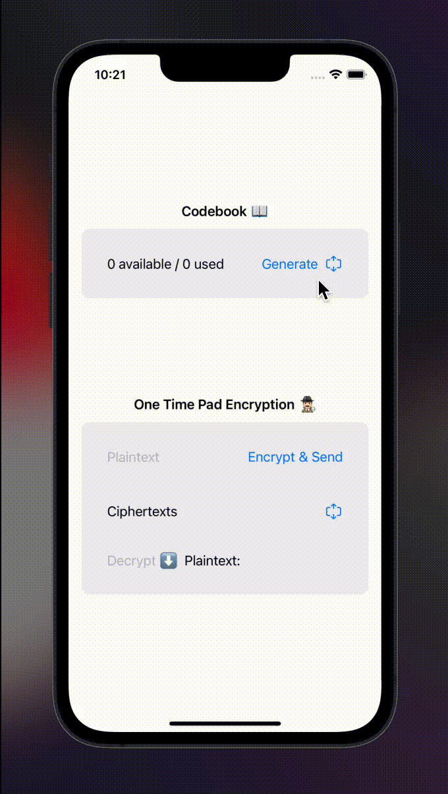
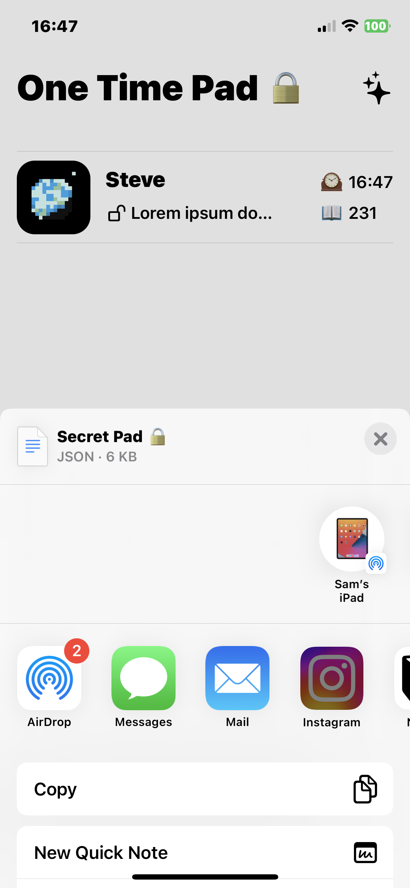
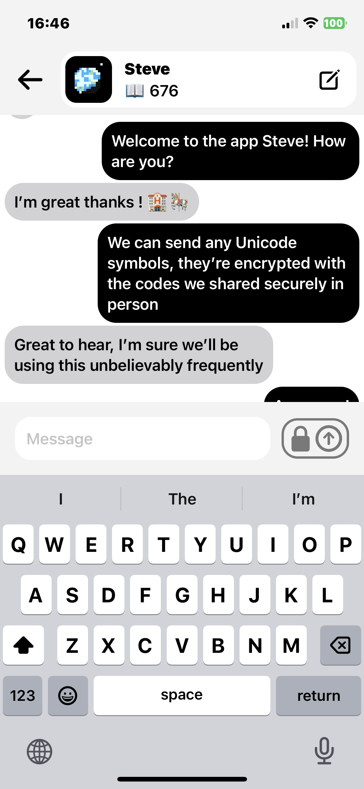
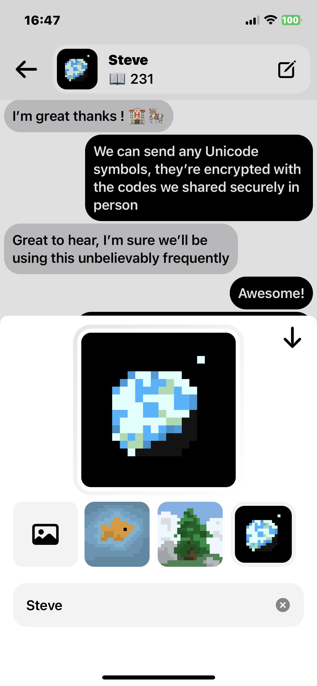

# One Time Pad Messaging App

## Brief

One time pad is a simple encryption concept, you use a unique key for each symbol you send, this is the only "information theoretically secure" encryption technique. However, this technique is entirely dependent on keeping the key secret, which is most of the challenge when establishing a connection through an untrusted network.

 

This technique was initially used by secret agents that would come together to share a "pad" of single use keys, hence establishing that connection in a safe way. They would use fresh keys for every message and then destroy them afterwards. What about an app where you share your pad of secret keys physically in person? Sounds fun.

 

This could instead be a fun feature living on top of a secure messaging app

 

## Features

- No sign in ✅
- One time pad Encryption ✅
- Firebase messaging backend (post encryption) ✅
- Share codebook with friends via Airdrop ✅

 

## V1

## V2

   
